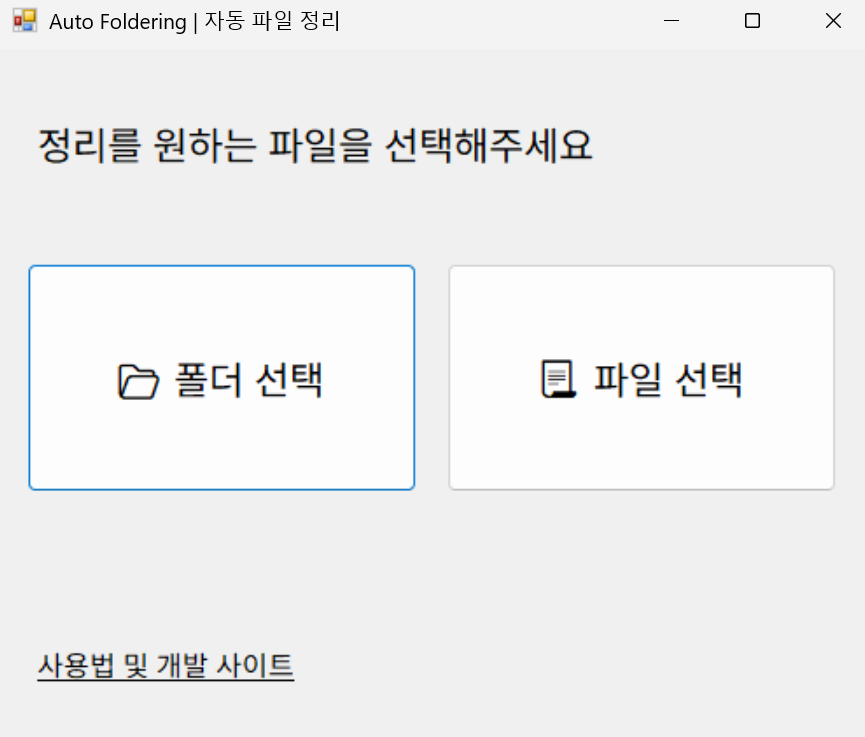

# Auto Foldering (날짜별 윈도우 파일 정리 앱)
> .NET 프레임워크의 UI 라이브러리 WinForms을 활용한 C# 프로젝트

 | 
--|--

- [EXE 다운로드 링크](https://github.com/tony96kimsh/Auto-Foldering/raw/refs/heads/main/Auto-Foldering.exe)

## 프로젝트 개요

### 제작 배경
윈도우 환경에서 흩어진 사진, 문서 등의 파일을 생성 날짜 기반으로 연도/월/주 단위로 자동 정리해주는 폴더링 도구가 필요했다. 사용자가 지정한 기준과 경로에 따라 파일을 깔끔하게 분류해주는 데스크탑 유틸리티를 제작하게 되었다.

### 기술 스택
- C# (.NET Framework)
- WinForms (윈도우 UI 프레임워크)
- System.IO (파일/디렉토리 처리)

### 주요 기능
1. OpenFileDialog를 통해 정리 대상 파일 선택
2. FolderBrowserDialog를 통해 저장 경로 설정
3. 파일 생성일 기준으로 연/월/주 폴더 자동 생성
4. 기준에 따라 파일 복사 또는 이동 (추후 옵션화 가능)
5. 라디오버튼을 통한 정리 기준 선택 UI
6. Placeholder 및 숫자 제한을 포함한 사용자 입력 기능
7. 원본 경로와 저장 경로 표시 및 변경 기능
8. 정리 실행 후 결과 확인 메시지 제공

## 프로젝트 구조

### 레이아웃 구성
- Form1: 파일 선택 및 저장 위치 지정, Form2로 이동
- Form2: 정리 기준 선택, 실행 및 경로 표시

### 폴더 구조
```
Auto_Foldering/
├── Form1.cs         # 초기 폴더/파일 선택 폼
├── Form2.cs         # 정리 기준 및 실행 폼
├── Program.cs       # Main 함수
├── *.Designer.cs    # 디자이너 자동 생성 파일
└── Resources/
    └── image.png
```

### 코드 구조
- Form1
  - receivedFiles 배열에 선택한 파일 저장
  - selectedDirectory를 통해 초기 경로 전달
- Form2
  - 라디오버튼 이벤트로 정리 기준 선택
  - `File.GetCreationTime()`으로 파일 날짜 판별
  - `Directory.CreateDirectory()`로 폴더 생성
  - `File.Copy()`로 정리 경로에 복사

## 추후 작업 및 이슈

### TODO
- 중복 파일 처리 로직 개선
- 정리 결과 요약 화면 또는 로그 기록 기능

### Issues
- 파일 경로가 긴 경우 UI 레이블 표시 깨짐
- 복수 파일 처리 시 성능 개선 필요
- 비정상 파일명 예외처리 추가 예정