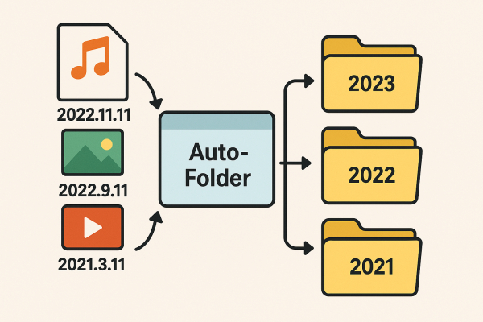
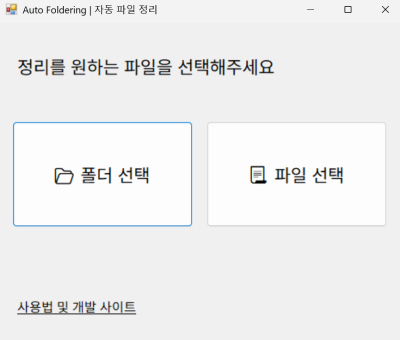
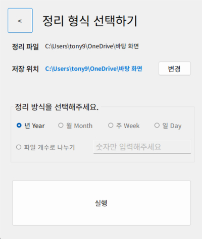

# 🗂️ Auto Foldering (날짜별 윈도우 파일 정리 앱)

- **[⬇ 실행 파일 다운로드 링크](https://github.com/tony96kimsh/Auto-Foldering/raw/refs/heads/main/bin/Release.zip)** (압축 해제 후 `Auto-Foldering.exe` 파일 실행)

- **[🛠️ 코드 및 어플리케이션 구조 안내](https://github.com/tony96kimsh/Auto-Foldering/blob/main/README.md)**

## 📚 사용 방법 (How to Use)
 

### 1. 프로그램 실행



- `Auto-Foldering.exe` 파일을 실행합니다.

### 2. 정리할 폴더 선택
- 메인 화면에서 **[폴더 열기]** 버튼을 클릭합니다.
- 날짜별로 정리하고 싶은 폴더(예: 다운로드 폴더)를 선택합니다.

### 3. 정리 방식 선택



- 원하는 정리 단위를 선택할 수 있습니다:
  - `년` → 2024
  - `월` → 2024-05
  - `주` → 2024-05-06_2024-05-12
    - 파일의 날짜에 해당하는 주간의 월요일~일요일
  - `일` → 2024-05-16
  - `개수` → 2024-05-04_2024-06-12
    - 최신 날짜 기준 입력한 파일 갯수대로 폴더에 담습니다.

### 4. [정리 시작] 버튼 클릭
- 선택한 폴더 안의 모든 파일들이 **생성일 기준**으로 자동 분류됩니다.
- 예시:
  ```plaintext
  정리 전:
  📁 Downloads
   ┣ photo.jpg (2024-05-01 생성)
   ┗ resume.docx (2024-05-02 생성)

  정리 후:
  📁 Downloads
   ┣ 📁 2024-05-01
   ┃   ┗ photo.jpg
   ┗ 📁 2024-05-02
       ┗ resume.docx
  ```

### 5. 정리 완료
- 정리가 완료되면 완료 메시지가 나타납니다.
- 폴더 구조를 확인하고 정리가 잘 되었는지 검토하세요.

---

### ⚠️ 참고 사항
- **폴더 내의 하위 폴더는 정리 대상에 포함되지 않습니다.**
- **파일의 생성일(Date Created)을 기준으로 폴더링됩니다.**
- 일부 외부 저장소(예: 구글 드라이브 동기화 폴더)에서는 생성일 정보가 정확하지 않을 수 있습니다.

---

### 🔄 기능 요약
- 생성일 기반 자동 정리
- 날짜 형식 선택 가능 (`년`, `년-월`, `년-월-일`)
- 한 번의 클릭으로 깔끔한 정리 완료
